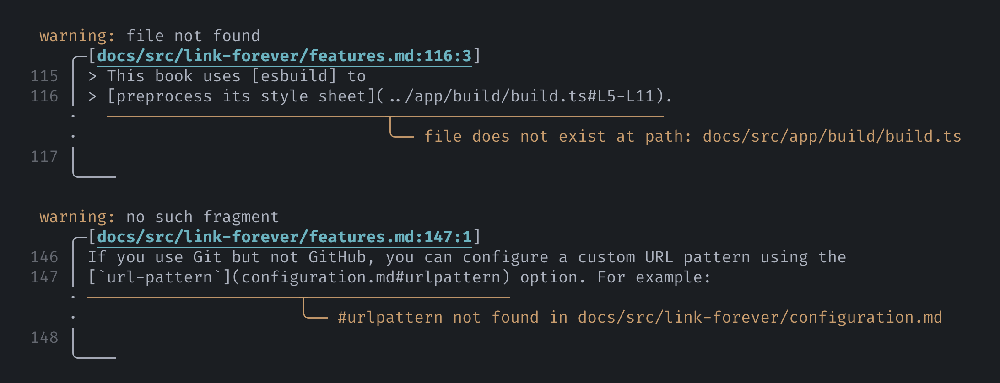

# relative paths

[Cargo.toml](../../../../Cargo.toml)

# absolute paths

[LICENSE-APACHE.md](/LICENSE-APACHE.md)

[links.md](/crates/mdbook-permalinks/src/tests/links.md#absolute-paths)

# fragments

[book.toml](/docs/book.toml#L40-44)

# book files

[Links](./links.md)

[main.rs](../main.rs)

# file not found

[Cargo.lock](../../Cargo.lock)

[`//LICENSE-MIT.md`](//LICENSE-MIT.md)

# canonical urls to book

found: <https://example.org/book/tests/links>

found: <https://example.org/book/tests/links.html>

not found: <https://example.org/book/404>

ignored: <https://example.com/book/links>

trailing slash, found: <https://example.org/book/tests/trailing-slash/>

trailing slash, found: <https://example.org/book/tests/trailing-slash>

trailing slash, not found: <https://example.org/book/tests/links/>

# canonical urls to HEAD

[permalink](https://github.com/lorem/ipsum/tree/HEAD/LICENSE-APACHE.md)

[published](https://github.com/lorem/ipsum/tree/HEAD/crates/mdbook-permalinks/src/tests/links.md)

[file not found](https://github.com/lorem/ipsum/raw/HEAD/crates/mdbook-permalinks/src/tests/shinjuku.jpg)

# image-in-link

[   Self-portrait of a female Macaca nigra in North Sulawesi (2011)](/crates/mdbook-permalinks/src/tests/Macaca_nigra_self-portrait_large.jpg)

[Foo]: https://example.org
[Bar]: https://example.org
