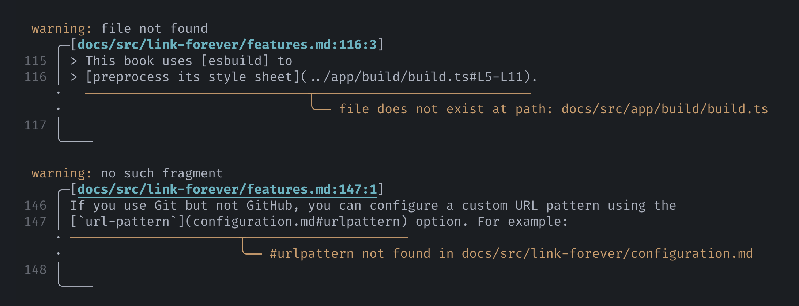

# Features

- [Permalinks](#permalinks)
- [Repo auto-discovery](#repo-auto-discovery)
- [Link validation](#link-validation)

## Permalinks

Simply use **relative paths** to link to any file in your source tree, and the
preprocessor will convert them to GitHub permalinks.

> ```md
> This project is dual licensed under the
> [Apache License, Version 2.0](../../../LICENSE-APACHE.md) and the
> [MIT (Expat) License](../../../LICENSE-MIT.md).
> ```
>
> This project is dual licensed under the
> [Apache License, Version 2.0](../../../LICENSE-APACHE.md) and the
> [MIT (Expat) License](../../../LICENSE-MIT.md).

Permalinks use the **tag name or commit SHA** of HEAD at build time, so you get a
rendered book with intra-repo links that are always _correct_ for that point in time.

> [!TIP]
>
> Linking by path is cool! Not only is it well-supported by GitHub, but editors like VS
> Code also provide smart features like [path completions][path-completions] and [link
> validation][link-validation].

URL fragments are preserved:

> ```md
> This book uses [esbuild] to
> [preprocess its style sheet](../../app/build/build.ts#L7-L16).
> ```
>
> This book uses [esbuild] to
> [preprocess its style sheet](../../app/build/build.ts#L7-L16).

By default, links to files under your book's `src/` directory are not converted, since
mdBook already [copies them to build output][mdbook-src-build], but this is configurable
using the [`always-link`](configuration.md#always-link) option.

## Repo auto-discovery

To know what GitHub repository to link to, the preprocessor looks at the following
places, in order:

1. The [`output.html.git-repository-url`] option in your `book.toml`
2. The URL of a Git remote named `origin`

> [!TIP]
>
> For Git remotes, both HTTP URLs and "scp-like" URIs (`git@github.com:org/repo.git`)
> are supported, thanks to the [`gix_url`] crate.

If you use Git but not GitHub, you can configure a custom URL pattern using the
[`url-pattern`](configuration.md#url-pattern) option. For example:

```toml
[preprocessor.link-forever]
url-pattern = "https://gitlab.haskell.org/ghc/ghc/-/tree/{ref}/{path}"
```

## Link validation

The preprocessor validates any path-based links and notifies you if they are broken.

<figure>



<figcaption>

Formatting of diagnostics powered by [miette]

</figcaption>

</figure>

> [!NOTE]
>
> Link validations are only supported for path-based links. For more comprehensive link
> checking, look to projects like [`mdbook-linkcheck`].

<!-- prettier-ignore-start -->

[path-completions]: https://code.visualstudio.com/docs/languages/markdown#_path-completions
[link-validation]: https://code.visualstudio.com/docs/languages/markdown#_link-validation
[mdbook-src-build]: https://rust-lang.github.io/mdBook/guide/creating.html#source-files
[`output.html.git-repository-url`]: https://rust-lang.github.io/mdBook/format/configuration/renderers.html#html-renderer-options
[esbuild]: https://esbuild.github.io
[`mdbook-linkcheck`]: https://github.com/Michael-F-Bryan/mdbook-linkcheck

<!-- prettier-ignore-end -->
