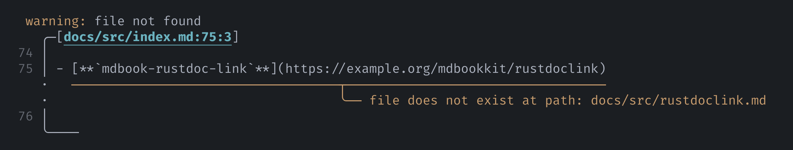

# Working with `{{#include}}`

mdBook provides an [`{{#include}}` directive][mdbook-include] that you can embed files
in book pages. If the embedded content also contains path-based links, then some extra
care may be needed:

- The preprocessor does not resolve links relative to the file being included (because
  it doesn't have enough information to do so). In this case, relative paths could be
  valid for the source file (and therefore valid for e.g. GitHub) but invalid for the
  book.

- In some situations, you cannot use path-based links and you have to use full URLs.
  This could be because the included file is also intended for platforms that don't
  support paths as links.

This page describes some workarounds for linking in included files.

- [Using absolute paths](#using-absolute-paths)
- [Using URLs to link to book pages](#using-urls-to-link-to-book-pages)

## Using absolute paths

To use paths as links in included content, you can use absolute paths that start with a
`/`. Paths that start with a `/` are resolved relative to the root of your repository:

> ```md
> Front page of this book is actually from
> [the crate README](/crates/mdbookkit/README.md).
> ```
>
> Front page of this book is actually from
> [the crate README](/crates/mdbookkit/README.md).

> [!TIP]
>
> This is also the behavior both in [VS Code][vscode-path-completions] and on
> [GitHub][github-relative-links].

## Using URLs to link to book pages

You may be in a situation where you have to use full URLs to link to your book rather
than relying on paths.

> An example (that this project encountered) is including files that are also intended
> for displaying on [crates.io][cargo-readme].
>
> In this case, since other platforms like crates.io will not convert path-based `.md`
> links to URLs, linking to book pages would require writing down full URLs to the
> deployed book.

To mitigate this, you can use the [`book-url`](configuration.md#book-url) option.

In your `book.toml`, in the `[preprocessor.link-forever]` table, specify the URL prefix
at which you will deploy your book:

```toml
[preprocessor.link-forever]
book-url = "https://example.org/"
```

Then, in Markdown, you may use full URLs, for example:

> ```md
> For a list of the crate's features, see [Feature flags](https://example.org/features).
> ```
>
> For a list of the crate's features, see [Feature flags](https://example.org/features).

Specifying `book-url` enables the preprocessor to check URLs to your book against local
paths. If a URL does not have a corresponding `.md` file under your book's `src/`
directory, the preprocessor will warn you:

<figure>



</figure>

> [!NOTE]
>
> `book-url` only enables validation, and is only for links to your book, not to GitHub.

<!-- prettier-ignore-start -->

[mdbook-include]: https://rust-lang.github.io/mdBook/format/mdbook.html#including-files
[vscode-path-completions]: https://code.visualstudio.com/docs/languages/markdown#_path-completions
[github-relative-links]: https://docs.github.com/en/get-started/writing-on-github/getting-started-with-writing-and-formatting-on-github/basic-writing-and-formatting-syntax#relative-links
[cargo-readme]: https://doc.rust-lang.org/cargo/reference/manifest.html#the-readme-field

<!-- prettier-ignore-end -->
