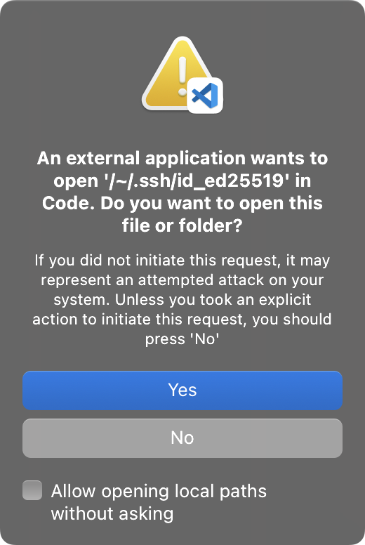

# How to preview links locally

As much as permalinks offer many benefits, using this preprocessor could also make it
more cumbersome to preview changes to your documentation.

Because the preprocessor generates permalinks using what's locally present in your
repository, until you have committed and pushed to remote, your links may not work
correctly!

- Links may be reachable but will continue to refer to an older commit, showing stale
  content;
- If you have added, moved, or deleted files, or if your local branch has diverged, then
  links become "broken" until you have updated your remote repository;
- If you rely on the preprocessor to [show images](../tutorial.md#images), the images
  may not load.

While the preprocessor assures that the links it generates are _eventually correct_ so
long as your remote is up-to-date, to make local editing more intuitive, the
preprocessor offers an experimental `dev-mode` option.


 

## Using `dev-mode`

In `book.toml`, specify `dev-mode = true`:

```toml config-example
[preprocessor.permalinks]
unstable-features = true
dev-mode = true
```

When `dev-mode` is in effect, instead of generating permalinks as usual:

- For `raw` links, such as those to be used in Markdown images, the preprocessor
  embeds[^data-url] their content directly into build output. Your images will correctly
  show in the mdBook preview.

- For other links, the preprocessor generates URLs that will
  [open the file or in your text editor](#opening-files-in-your-editor) when clicked.

In other words, while you won't be able to see the exact URLs being generated, you will
be able to preview how your links behave!

## Opening files in your editor

While `dev-mode` is in effect, for any clickable link that are supposed to open a
webpage on your Git forge's website, the preprocessor will instead generate a link that
tries to open the file or directory in your text editor.

By default, the text editor is VS Code. The preprocessor will generate links with URLs
in the form of `vscode://file/path/to/file`, which VS Code should have setup your system
to handle[^vscode-uri].

If you are using a different editor, you can change the format of the generated links by
setting the <code class="nowrap">dev-mode.editor-uri</code> option. For example, you can
set the preprocessor to open links in [Zed](https://zed.dev/) by specifying [its URL
scheme][zed-uri]:

```toml config-example
[preprocessor.permalinks]
unstable-features = true

[preprocessor.permalinks.dev-mode]
editor-uri = "zed://file/{path}"
```

> [!NOTE]
>
> For security reasons[^file-url-issues], browsers do not allow a webpage on an HTTP(S)
> address to link to a local file or folder (such a link, if allowed, would have a [file
> URI][file-uri]). This restriction applies even to webpages on localhost! Because of
> this, the preprocessor implemented opening paths in text editors as a compromise.
>
> Even so, your browser/editor may still require extra confirmation out of an abundance
> of caution when you click on such links. Prompts like the one below are expected:
>
> <figure>
>        alt="screenshot of a confirmation dialog from VS Code about opening a local file"
>     style="height: 310px; width: fit-content;">
>   <figcaption>
>     An example of the confirmation dialog from VS Code
>   </figcaption>
> </figure>

## Building for deployment

> [!IMPORTANT]

Because `dev-mode` is meant to be helpful for local editing only, it will not take
effect when the preprocessor is running in a CI/CD environment, for example, when it is
[running in GitHub Actions][gh-actions].

This means that if you are doing automated deployment in CI/CD, then you can leave the
`dev-mode` option in `book.toml`, and it will not affect your workflow.

However, if you are manually building and deploying your book, such as by running
`mdbook build` locally, **then you must set the `CI` environment variable when invoking
`mdbook`.**

```sh
CI=1 mdbook build
```

Without the `CI` variable, the special editor URIs and embedded data due to `dev-mode`
will remain in your build output, which is very likely not what you wanted!

To learn more about how the preprocessor's default behaviors change when it is running
in CI, see [the next chapter](continuous-integration.md).

[^data-url]:
    Instead of generating regular HTTP URLs, the preprocessor uses
    [data URLs](https://developer.mozilla.org/en-US/docs/Web/URI/Reference/Schemes/data),
    a special form of URLs that can fully encode any type of binary data. Browsers
    support displaying images from data URLs without making requests to external
    servers.

[^vscode-uri]:
    This type of URL handling is officially
    [documented](https://code.visualstudio.com/docs/configure/command-line#_opening-vs-code-with-urls)
    to be used with VS Code extensions.

[^file-url-issues]:
    See issues related to this on the
    [Firefox](https://bugzilla.mozilla.org/show_bug.cgi?id=69070#c0) and
    [Safari](https://bugs.webkit.org/show_bug.cgi?id=16048#c1) bug trackers.

<!-- prettier-ignore-start -->
[file-uri]: https://en.wikipedia.org/wiki/File_URI_scheme
[zed-uri]: https://github.com/zed-industries/zed/issues/8482
[gh-actions]: https://github.com/rust-lang/mdBook/wiki/Automated-Deployment%3A-GitHub-Actions#github-pages-deploy
<!-- prettier-ignore-end -->
