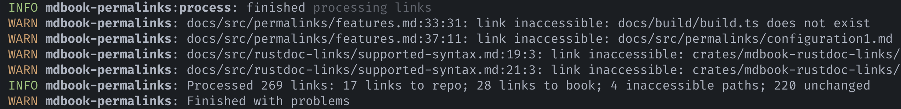

# Logging

With the environment variables `MDBOOK_LOG` and `CI`, you can control how the
preprocessor emits logs and diagnostic information.

## Output style

{{#include ../snippets/logging/output-style.md}}

<figure>

<figcaption>

Diagnostics are displayed in a graphical manner by default.

</figcaption>

</figure>

<figure>

<figcaption>

The same diagnostics emitted as logs

</figcaption>

</figure>

## `MDBOOK_LOG`

{{#include ../snippets/logging/env-var.md}}
