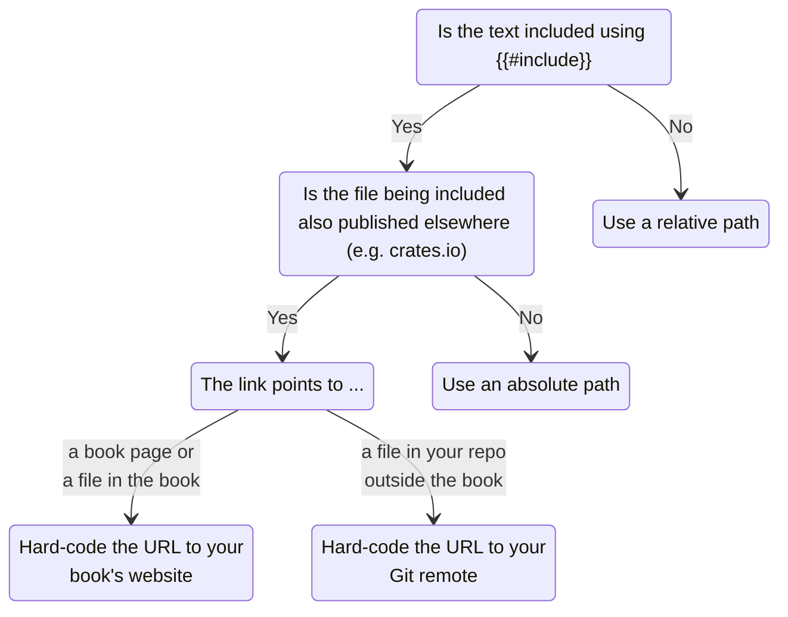

# More ways to link

Linking by relative path should cover the majority of use cases. However, there are
cases where this may not work:

- When working with mdBook's `{{#include}}` directive, relative paths may become
  incorrect;
- Furthermore, the included document may also be intended for additional platforms,
  where path-based links are not supported.

For such cases, the preprocessor supports some alternative link formats. Here is a
simplified guide on when to use which format:

<figure style="height: 480px">



</figure>

## Using absolute paths

mdBook provides the [`{{#include}}` directive][mdbook-include] which allows you to
include the content of other text files directly in book pages. The preprocessor cannot
resolve links relative to the file being included. In this case, relative paths could be
valid for the source file (and therefore valid for e.g. GitHub) but invalid for the
book.

> For example, if `chapters/1.md` includes `shared/info.md`, and `shared/info.md`
> contains a link to `./image.png` (i.e. `shared/image.png`), then the preprocessor can
> only resolve `./image.png` starting from `chapters/1.md`, which becomes
> `chapters/image.png`, which is incorrect.

Instead of using relative paths, you may use paths that **start with a `/`**. Paths that
start with a `/` are resolved **relative to the root of your repository**:

> ```md
> The [home page](/docs/src/index.md) simply embeds the project [README](/README.md).
> ```
>
> The [home page](/docs/src/index.md) simply embeds the project [README](/README.md).

## Using URLs

In some situations, you cannot link using paths, and must fallback to full URLs. For
example, you may want to reuse your package's `README.md` for your book's home page,
where the `README.md` is also published to crates.io, where path-based links will become
invalid.

### Using URLs to HEAD

You can create permalinks to files in your source tree by writing URLs where the
commit/ref portion is **`HEAD`**, for example:

> ```md
> [Cargo.toml](https://github.com/tonywu6/mdbookkit/raw/HEAD/Cargo.toml)
> ```
>
> [Cargo.toml](https://github.com/tonywu6/mdbookkit/raw/HEAD/Cargo.toml)

- For your book, the preprocessor replaces `HEAD` with the tag name or commit hash at
  build time. The link type (`tree`/`blob` or `raw`) is preserved.
- For other sites, the link remains functional and will point to `HEAD`.
- If, after parsing, the link's corresponding file path is inaccessible during build,
  the preprocessor will emit a warning.

> [!IMPORTANT]
>
> The commit/ref must be exactly `HEAD`. **Other common refs such as `main` are not
> processed.**

### Using URLs to your book

You can link to a page or file within your book using full URLs and the preprocessor
will validate that the corresponding file is accessible.

To enable validation of book URLs, you must specify the URL prefix at which you will
deploy your book via the [`book-url`](configuration.md#book-url) option:

```toml
[preprocessor.permalinks]
book-url = "https://example.org/book/"
```

For each link that begins with this prefix, the preprocessor tests whether a matching
file path is accessible:

1. The suffix `.html`, if present, is removed;

2. Depending on whether the resulting path contains a [trailing slash][trailing-slash],
   the following candidate paths are tested:

   |                         | `path/to.doc` | `path/to.doc/` |
   | :---------------------- | :-----------: | :------------: |
   | `path/to.doc/index.md`  |       ✓       |       ✓        |
   | `path/to.doc/README.md` |       ✓       |       ✓        |
   | `path/to.doc.md`        |       ✓       |                |
   | `path/to.doc`           |       ✓       |                |

- If none of the paths are accessible for a URL, the preprocessor will emit a warning.
- For your book, the preprocessor rewrites the URL as a relative path (so that mdBook
  processes it as usual).
- For other sites, the link remains functional and will link to your book's website.

> [!NOTE]
>
> You may notice that the `book-url` option is repeating mdBook's builtin
> [`output.html.site-url`] option. There is currently an issue that prevents
> preprocessors from properly reusing the builtin option during `mdbook serve`.

<!-- prettier-ignore-start -->
[`output.html.site-url`]: https://rust-lang.github.io/mdBook/format/configuration/renderers.html#html-renderer-options
[mdbook-include]: https://rust-lang.github.io/mdBook/format/mdbook.html#including-files
[trailing-slash]: https://github.com/slorber/trailing-slash-guide?tab=readme-ov-file#trailing-slash-guide
<!-- prettier-ignore-end -->
