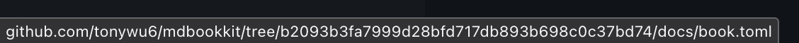

# Tutorial

This tutorial will walk you through the steps necessary to use the preprocessor. After
setup, you will be writing some links in an mdBook project to see how the preprocessor
works.

## Prerequisites

This tutorial assumes that:

- You already have a working mdBook project. If you need to, feel free to follow
  [mdBook's tutorial][mdbook-tutorial] to first create a book.

- Your book has been checked into Git, and your repo has at least 1 commit. If not, try
  adding an initial commit first.

  > [!TIP]
  >
  > For best results, use a repository that you have already pushed online.

  <p><details>
    <summary>Explanation</summary>

  The preprocessor generates permalinks that are tied to a specific commit hash. Without
  at least a commit, links generated by the preprocessor wouldn't really be useful.

  </details></p>

## Install

<!-- prettier-ignore-start -->

  

<!-- prettier-ignore-end -->

## Configure

To be able to use the preprocessor, there are generally 2 required configurations:

1. Enable the preprocessor.
2. Tell the preprocessor the URL to your Git repository.

First, enable the preprocessor by adding the following table to your `book.toml`:

```toml config-example
[preprocessor.permalinks]
after = ["links"]
```

<p><details>
  <summary>Explanation</summary>

```diff config-example
+ [preprocessor.permalinks]
```

Adding this table tells mdBook to execute the command `mdbook-permalinks` during builds.

```diff config-example
  [preprocessor.permalinks]
+ after = ["links"]
```



Adding this tells mdBook to run this preprocessor after the default [`links`
preprocessor][mdbook-links]. This is recommended because it allows the preprocessor to
see text embedded using the [`{{#include}}` directive][mdbook-include].



</details></p>

Then, for the preprocessor to be able to generate permalinks, it must also know where
your repository can be accessed online.

There are several ways to provide this information. For this tutorial, add the following
option to your `book.toml`. Feel free to update the URL to your repo's actual URL:

```diff config-example
+ [output.html]
+ git-repository-url = "https://github.com/me/awesome-repo"

  [preprocessor.permalinks]
  after = ["links"]
```

The `git-repository-url` option is part of mdBook's builtin [HTML renderer
options][mdbook-html]. When set, mdBook renders an icon link on the right side of the
top menu bar that opens the configured URL. The preprocessor reuses this option as the
base of the generated permalinks.

Note that your `book.toml` may already have the `[output.html]` table. You may also have
already set the `git-repository-url` option. If so, you can simply keep its existing
value.

<p><details>
  <summary>What sites are supported?</summary>

The preprocessor knows the different permalink formats of a few forges, based on the
domain name of the configured URL. If your repo does not use one of the following
supported sites, you will see an error when running the preprocessor:

- [`github.com`](https://github.com)
- [`codeberg.org`](https://codeberg.org)
- [`tangled.org`](https://tangled.org)

To continue with this tutorial, you can temporarily set the option to a repo on one of
the supported sites, such as `https://github.com/rust-lang/mdBook`. The generated links
will likely open up to a 404 page, but you will be able to see how the links will look
like.

</details></p>

## Write

### Linking by paths

You are now ready to add permalinks to your book!

<aside><p><details>
  <summary>Side note: What is a permalink?</summary>

To recap, a ["permalink"] is a link that always opens up a file or directory in your Git
repository _at a specific commit._ The link is considered "permanent" because the
content it points to does not change even as your Git history evolves. For example,
compare the following links to the `README.md` file in the rust-lang/rust repository on
GitHub:

- [<code>https://github.com/rust-lang/rust/blob/<strong>main</strong>/README.md</code>](https://github.com/rust-lang/rust/blob/main/README.md)
  - This is not a permalink, because it points to the `README.md` file at the latest
    commit on the `main` branch. As the branch updates, so could the file's content.

- [<code>https://github.com/rust-lang/rust/blob/<strong>a469a4ae63</strong>/README.md</code>](https://github.com/rust-lang/rust/blob/a469a4ae63/README.md)
  - This is a permalink. It always points to the `README.md` file at commit
    `a469a4ae63`. Unless the commit itself has been deleted, the link will always link
    to the same copy of the file.

</details></p></aside>

For this tutorial, add a link to your book's `book.toml` config file, but in the URL
portion of the link, **use a relative path to the file.**

If you are adding it to one of your book's top-level pages, the link could look
something like this: [^path-autocomplete]

<figure>

```md
See [`book.toml`](../book.toml) for more info.
```

<figcaption>
  Example link in <code>book/src/intro.md</code>
</figcaption>

</figure>

<figure>

```
book/
├── src/
│   └── intro.md
└── book.toml
```

<figcaption>
  <code>../book.toml</code> is the path from <code>book/src/intro.md</code> to
  <code>book/book.toml</code>
</figcaption>

</figure>

You may now run `mdbook serve`. In the rendered page, you should see the added link:

<figure class="fig-text">

See [`book.toml`](../../book.toml) for more info.

</figure>

Click on the link to open it, or hover on it if you are on desktop. You should see that
the URL behind the link has been changed to a full URL, and the URL contains the hash of
the commit that your repository is currently checked out at.

For example, as of writing this, the link to this book's `book.toml` is:

<figure>



</figure>

Feel free to keep `mdbook serve` running, and experiment with linking to some other
files or directories in your repository!

### Linking by "absolute" paths

You can also **use an "absolute" path,** which starts with a `/`, when writing the link.

Instead of being relative to the current Markdown file, "absolute" paths are relative to
the root of your Git repository. This could be useful for linking to files that are far
away, and you don't want to traverse multiple levels of parent directories, like
`../../..`.

Here are some more examples, using various other files in this repository:

> ```md
> - [One of the preprocessor's test cases](/crates/mdbook-permalinks/tests/file_links)
> - [This website is hosted on Cloudflare](/docs/main.ts)
> ```
>
> - [One of the preprocessor's test cases](/crates/mdbook-permalinks/tests/file_links)
> - [This website is hosted on Cloudflare](/docs/main.ts)

> ```md
> All Markdown link formats are supported. Here is a [reference link][main.rs].
>
> [main.rs]: /crates/mdbook-permalinks/src/main.rs
> ```
>
> All Markdown link formats are supported. Here is a [reference link][main.rs].
>
> [main.rs]: /crates/mdbook-permalinks/src/main.rs

### Files in your book

Note that links pointing to files under your book's source directory are not modified by
this preprocessor. Since mdBook always copies everything in the source directory to the
output directory, such links can be kept as-is.

For example, the following link points to a file on this website instead of on GitHub:

> ```md
> [Social image for this page](./_media/social.webp)
> ```
>
> [Social image for this page](./_media/social.webp)

### Links with fragments

You can include **URL fragments** in the links, which are the portion at the end of an
URL delimited by the `#` character. The preprocessor preserves URL fragments.

For example, on supported forges such as GitHub, you can add a `#L..` fragment to the
link to highlight specific lines in the destination source code:

> ```md
> See the package's [`[dependencies]` table][dependencies] for more info.
>
> [dependencies]: /crates/mdbook-permalinks/Cargo.toml#L21-33
> ```
>
> See the package's [`[dependencies]` table][dependencies] for more info.
>
> [dependencies]: /crates/mdbook-permalinks/Cargo.toml#L21-33

### Images

Finally, with this preprocessor, you can use permalinks to display image files that are
stored elsewhere in your repository.

Most forges that support permalinking support 2 versions of the links:

- A link that opens up the file's webpage for viewing (with the forge's UI and
  everything)
  - For example, on GitHub, such links are denoted by either `tree` or `blob` in their
    paths: <br>
    [<code>https://github.com/tokio-rs/tracing/<strong>blob</strong>/add986d/assets/logo.svg</code>](https://github.com/tokio-rs/tracing/blob/add986d/assets/logo.svg)

- A link that directly serves the file's raw content, suitable for embedding or
  downloading
  - For example, on GitHub, such links are denoted by `raw` in their paths: <br>
    [<code>https://github.com/tokio-rs/tracing/<strong>raw</strong>/add986d/assets/logo.svg</code>](https://github.com/tokio-rs/tracing/raw/add986d/assets/logo.svg)

If you use a file path as the URL in a Markdown image, as in
``, the preprocessor can accordingly convert the link to a
version of the permalink that serves raw content.

As a combined example, the following snippet will link to an image file in this
repository both as a displayed image and as a clickable link:

<!-- prettier-ignore-start -->
> ```md
> [![Minato City][minato-city]][minato-city]
>
> [minato-city]: /crates/mdbook-permalinks/tests/file_links/static/Minato_City,_Tokyo,_Japan.jpg
> ```
>
> [![Minato City][minato-city]][minato-city]
>
> [minato-city]: /crates/mdbook-permalinks/tests/file_links/static/Minato_City,_Tokyo,_Japan.jpg
<!-- prettier-ignore-end -->

## Check

_It happens:_ You made a typo when writing the link. Or perhaps more likely, the file or
directory that you previously linked to has been moved or deleted, but you haven't
updated your book yet. _Broken links are simply a fact of life._

The preprocessor will warn you when it detects that a link points to a non-existent
path.

For this tutorial, let's say you typed it wrong when trying to add a link to the
`book.toml` file:

```diff
- See [`book.toml`](../book.toml) for more info.
+ See [`book.toml`](../nook.toml) for more info.
```

Edit your book and save. If `mdbook serve` is still running, you should now see a
warning in your terminal, similar to the following:

<figure>



<figcaption>

Formatting of diagnostics powered by [annotate-snippets][annotate_snippets]

</figcaption>

</figure>

## Next steps

Thus concludes the tutorial! I hope you find this preprocessor useful.

[^path-autocomplete]:
    Your code editor may support path auto-completion. For example, see [VS
    Code][vscode-path-completions].

<!-- prettier-ignore-start -->
[mdbook-tutorial]: https://rust-lang.github.io/mdBook/guide/creating.html
[mdbook-include]: https://rust-lang.github.io/mdBook/format/mdbook.html#including-files
[mdbook-links]: https://rust-lang.github.io/mdBook/format/configuration/preprocessors.html#:~:text=The%20following%20preprocessors%20are%20built%2Din%20and%20included%20by%20default:
[mdbook-html]: https://rust-lang.github.io/mdBook/format/configuration/renderers.html#html-renderer-options
["permalink"]: https://en.wikipedia.org/wiki/Permalink
[vscode-path-completions]: https://code.visualstudio.com/docs/languages/markdown#_path-completions
<!-- prettier-ignore-end -->
