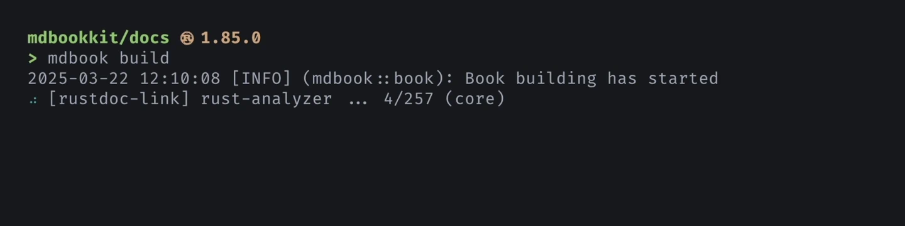

# mdbook-rustdoc-link

<div class="hidden">

**For best results, view this page at
<https://tonywu6.github.io/mdbookkit/rustdoc-link>.**

</div>

**[_rustdoc_-style linking][rustdoc] for [mdBook]** (with the help of [rust-analyzer]).

You write:

```md
The [`option`][std::option] and [`result`][std::result] modules define optional and
error-handling types, [`Option<T>`] and [`Result<T, E>`]. The [`iter`][std::iter] module
defines Rust's iterator trait, [`Iterator`], which works with the `for` loop to access
collections. [^1]
```

You get:

<figure class="fig-text">

The [`option`][std::option] and [`result`][std::result] modules define optional and
error-handling types, [`Option<T>`] and [`Result<T, E>`]. The [`iter`][std::iter] module
defines Rust's iterator trait, [`Iterator`], which works with the `for` loop to access
collections. [^1]

</figure>

`mdbook-rustdoc-link` is an mdBook [preprocessor]. Using rust-analyzer, it converts type
names, module paths, and so on, into links to online crate docs. No more finding and
pasting URLs by hand.

<figure>



</figure>

## Overview

To get started, simply follow the [quickstart guide](rustdoc-link/getting-started.md)!

If you would like to read more about this crate:

For **writing documentation** —

- To learn more about how it is resolving items into links, including
  [feature-gated items](rustdoc-link/name-resolution.md#feature-gated-items), see
  [Name resolution](rustdoc-link/name-resolution.md).
- To know how to link to other types of items like
  [functions, macros](rustdoc-link/supported-syntax.md#functions-and-macros), and
  [implementors](rustdoc-link/supported-syntax.md#implementors-and-fully-qualified-syntax),
  see [Supported syntax](rustdoc-link/supported-syntax.md).

For **adapting this crate to your project** —

- If you use [Cargo workspaces][workspaces], see specific instructions in
  [Workspace layout](rustdoc-link/workspace-layout.md).
- If you are working on a large project, and processing is taking a long time, see the
  discussion in [Caching](rustdoc-link/caching.md).

For **additional usage information** —

- You can use this as a standalone command line tool: see
  [Standalone usage](rustdoc-link/standalone-usage.md).
- For all available options and how to set them, see
  [Configuration](rustdoc-link/configuration.md).
- Finally, review [Known issues](rustdoc-link/known-issues.md) and limitations.

Happy linking!

## License

This project is released under the [Apache 2.0 License](/LICENSE-APACHE.md) and the
[MIT License](/LICENSE-MIT.md).

---

[^1]: Text adapted from [<cite>A Tour of The Rust Standard Library</cite>][tour]

<!-- prettier-ignore-start -->

[mdBook]: https://rust-lang.github.io/mdBook/
[preprocessor]: https://rust-lang.github.io/mdBook/format/configuration/preprocessors.html
[rust-analyzer]: https://rust-analyzer.github.io/
[rustdoc]: https://doc.rust-lang.org/rustdoc/write-documentation/linking-to-items-by-name.html
[tour]: https://doc.rust-lang.org/stable/std/#a-tour-of-the-rust-standard-library
[workspaces]: https://doc.rust-lang.org/book/ch14-03-cargo-workspaces.html

<!-- prettier-ignore-end -->
