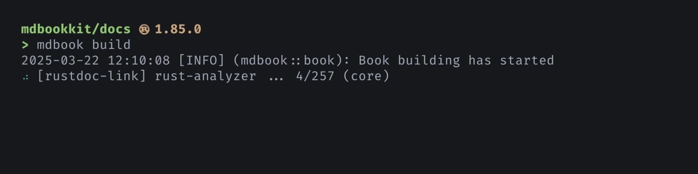

# mdbook-rustdoc-link

<div class="hidden">

**For best results, view this page at
<https://tonywu6.github.io/mdbookkit/rustdoc-link>.**

</div>

Link to Rust API docs by name in [mdBook], [_rustdoc_-style][rustdoc].

Instead of manually finding and pasting URLs, you simply write ...

```md
The [`option`][std::option] and [`result`][std::result] modules define optional and
error-handling types, [`Option<T>`] and [`Result<T, E>`]. The [`iter`][std::iter] module
defines Rust's iterator trait, [`Iterator`], which works with the `for` loop to access
collections. [^1]
```

... and you will get:

<figure class="fig-text">

The [`option`][std::option] and [`result`][std::result] modules define optional and
error-handling types, [`Option<T>`] and [`Result<T, E>`]. The [`iter`][std::iter] module
defines Rust's iterator trait, [`Iterator`], which works with the `for` loop to access
collections. [^1]

</figure>

<figure>



</figure>

> [!NOTE]
>
> This preprocessor depends on [rust-analyzer] to accurately resolve Rust items.

## Overview

Follow the [quickstart guide](getting-started.md) to try out the preprocessor.

For **writing documentation** —

- To learn more about how the preprocessor resolves items into links, including
  [feature-gated items](name-resolution.md#feature-gated-items), see
  [Name resolution](name-resolution.md).
- To learn how to link to additional items such as
  [functions, macros](supported-syntax.md#functions-and-macros), and
  [implementors](supported-syntax.md#implementors-and-fully-qualified-syntax), see
  [Supported syntax](supported-syntax.md).

For **making the preprocessor work with your project** —

- If you use [Cargo workspaces][workspaces], see specific instructions in
  [Workspace layout](workspace-layout.md).
- If you are working on a large project, and processing is taking a long time, see the
  discussion in [Caching](caching.md).

For **additional usage information** —

- You can use this as a standalone command line tool: see
  [Standalone usage](standalone-usage.md).
- For tips on using this in CI, see [Continuous integration](continuous-integration.md).
- For all available options and how to set them, see [Configuration](configuration.md).
- Finally, review [Known issues](known-issues.md) and limitations.

Happy linking!

## License

This project is released under the [Apache 2.0 License](/LICENSE-APACHE.md) and the
[MIT License](/LICENSE-MIT.md).

[^1]: Text adapted from [<cite>A Tour of The Rust Standard Library</cite>][tour]

<!-- prettier-ignore-start -->

[mdBook]: https://rust-lang.github.io/mdBook/
[preprocessor]: https://rust-lang.github.io/mdBook/format/configuration/preprocessors.html
[rust-analyzer]: https://rust-analyzer.github.io/
[rustdoc]: https://doc.rust-lang.org/rustdoc/write-documentation/linking-to-items-by-name.html
[tour]: https://doc.rust-lang.org/stable/std/#a-tour-of-the-rust-standard-library
[workspaces]: https://doc.rust-lang.org/book/ch14-03-cargo-workspaces.html

<!-- prettier-ignore-end -->
