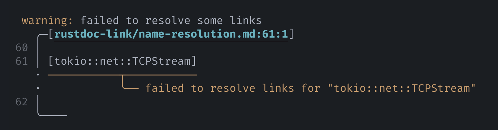
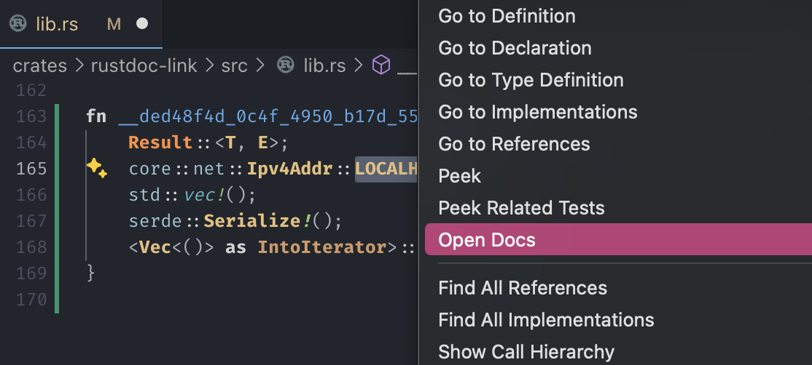

# Name resolution

`mdbook-rustdoc-link` resolves items in the context of your crate's "entrypoint", which
is usually your `lib.rs` or `main.rs` (the [specific rules](#which-entrypoint) are
mentioned below).

> [!TIP]
>
> If you use Cargo workspaces, or if your source tree has special layouts, see
> [Workspace layout](workspace-layout.md) for more information.

An item must be **in scope in the entrypoint** for the proprocessor to generate a link
for it.

Let's say you have the following as your `lib.rs`:

<figure>

```rs
use anyhow::Context;
/// Type that can provide links.
pub trait Resolver {}
mod env {
    /// Options for the preprocessor.
    pub struct Config {}
}
```

</figure>

Items in the entrypoint can be linked to with just their names:

> ```md
> [`Resolver`] — Type that can provide links.
>
> This crate also uses the [`Context`] trait from [`anyhow`].
> ```
>
> [`Resolver`] — Type that can provide links.
>
> This crate also uses the [`Context`] trait from [`anyhow`].

This includes items from the prelude (unless you are using `#![no_implicit_prelude]`):

> ```md
> [`FromIterator`] is in the prelude starting from Rust 2021.
> ```
>
> [`FromIterator`] is in the prelude starting from Rust 2021.

Though technically not required — to make items from your crate more distinguishable
from others in the Markdown source code, you can write `crate::*`:

> ```md
> [Configurations](configuration.md) for the preprocessor is defined in the
> [`Config`][crate::env::Config] type.
> ```
>
> [Configurations](configuration.md) for the preprocessor is defined in the
> [`Config`][crate::env::Config] type.

For everything else, provide its full path, as if you were writing a `use` declaration:

> ```md
> [`JoinSet`][tokio::task::JoinSet] is analogous to `asyncio.as_completed`.
> ```
>
> [`JoinSet`][tokio::task::JoinSet] is analogous to `asyncio.as_completed`.

> [!TIP]
>
> In short, write links the way you `use` an item in your `lib.rs` or `main.rs`.

The preprocessor will emit a warning if an item cannot be resolved:

<figure>



<figcaption>

Formatting of diagnostics powered by [miette]

</figcaption>

</figure>

This is something to remember especially if you are including doc comments as part of
your Markdown docs. Only rustdoc has the ability to [resolve names from where the
comments are written][rustdoc-scoping], so links that work in doc comments may not work
when using this preprocessor!

## Feature-gated items

To link to items that are gated behind features, use the
[`cargo-features`](configuration.md#cargo-features) option.

For example, [clap] is known for providing guide-level documentation through docs.rs.
The tutorial for its Derive API is gated behind the `unstable-doc` feature. To link to
such items, configure the necessary features:

```toml
[preprocessor.rustdoc-link]
cargo-features = ["clap/unstable-doc"]
```

Then, specify the item as normal:

> ```md
> [Tutorial for clap's Derive API][clap::_derive::_tutorial]
> ```
>
> [Tutorial for clap's Derive API][clap::_derive::_tutorial]

## Which entrypoint

The "entrypoint" is usually `src/lib.rs` or `src/main.rs`.

- If your crate has multiple `bin` targets, it will use the first one listed in your
  `Cargo.toml`.
- If your crate has both `lib` and `bin`s, it will prefer `lib`.
- If your crate has custom paths in `Cargo.toml` instead of the default `src/lib.rs` or
  `src/main.rs`, it will honor that.

## How it works

> [!NOTE]
>
> The following are implementation details.

`mdbook-rustdoc-link` parses your book and collects every link that looks like a Rust
item. Then it synthesizes a Rust function that spells out all the items, which looks
roughly like this:

```rs
fn __ded48f4d_0c4f_4950_b17d_55fd3b2a0c86__ () {
    Result::<T, E>;
    core::net::Ipv4Addr::LOCALHOST;
    std::vec!();
    serde::Serialize!();
    <Vec<()> as IntoIterator>::into_iter;
    // ...
}
```

> Note that this is barely valid Rust — `Result::<T, E>;` is a type without a value, and
> you wouldn't use `serde::Serialize` as a regular macro.
>
> This is where language servers like rust-analyzer excel — they can [provide maximally
> useful information out of badly-shaped code][why-lsp].

The preprocessor appends this fake function to your `lib.rs` or `main.rs` (in memory, it
doesn't modify your file) and [sends][didOpen] it to rust-analyzer. Then, for each item
that needs to be resolved, the preprocessor sends an [external documentation
request][externalDocs].

```json
{
  "jsonrpc": "2.0",
  "method": "experimental/externalDocs",
  "params": {
    "textDocument": { "uri": "file:///src/lib.rs" },
    "position": { "line": 6, "character": 17 }
  }
}
```

Hence item names in your book must be resolvable from your crate entrypoint!

This process is as if you had typed a name into your source file and used the "Open
Docs" feature — except it's fully automated.

<figure id="media-open-docs">
  
</figure>

<style>
  @media screen and (min-width: 768px) {
    #media-open-docs {
      height: 250px;
    }
  }
</style>

<!-- prettier-ignore-start -->

[rustdoc-scoping]: https://doc.rust-lang.org/rustdoc/write-documentation/linking-to-items-by-name.html#valid-links
[didOpen]: https://microsoft.github.io/language-server-protocol/specifications/lsp/3.17/specification/#textDocument_didOpen
[why-lsp]: https://matklad.github.io/2022/04/25/why-lsp.html#Alternative-Theory:~:text=a%20language%20server%20must%20analyze%20any%20invalid%20program%20as%20best%20as%20it%20can.%20Working%20with%20incomplete%20and%20invalid%20programs%20is%20the%20first%20complication%20of%20a%20language%20server%20in%20comparison%20to%20a%20compiler.
[externalDocs]: https://rust-analyzer.github.io/book/contributing/lsp-extensions.html#open-external-documentation

<!-- prettier-ignore-end -->
