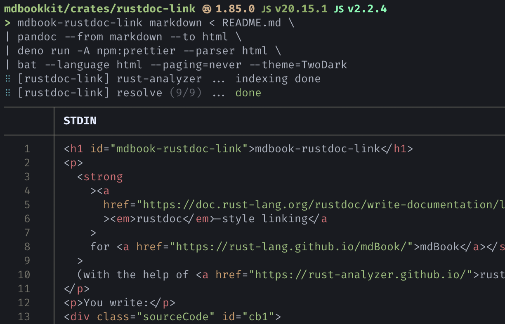

# Standalone usage

You can use `mdbook-rustdoc-link` as a standalone Markdown processor from the command
line.

Simply use the `markdown` subcommand, send your Markdown through stdin, and receive the
result through stdout, for example:

```bash
mdbook-rustdoc-link markdown < README.md
```

The command accepts as arguments all [options](configuration.md) configurable in
`book.toml`, such as [`--cache-dir`](configuration.md#cache-dir). Run
`mdbook-rustdoc-link markdown --help` to see them.

<figure id="media-open-docs">
  
  <figcaption>Use it in any text processing pipeline!</figcaption>
</figure>

<style>
  @media screen and (min-width: 768px) {
    #media-open-docs {
      height: 392px;
    }
  }
</style>
