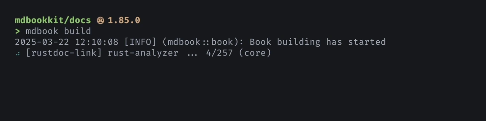

# Getting started

## Install

You will need to:

1. Have [rust-analyzer].:
   - If you already use the [VS Code extension][ra-extension], no setup is required: the
     preprocessor automatically uses the server binary packaged with it.
   - Otherwise, [install][ra-install] rust-analyzer (e.g. via `rustup`) and make sure it
     is available on `PATH`.

2. Install the preprocessor:

   ```
   cargo install mdbook-rustdoc-links
   ```

   Alternatively, you may obtain precompiled binaries from [GitHub
   releases][gh-releases].

{{#include ../snippets/mdbook-0.4.md}}

## Configure

Configure your `book.toml` to use the installed program as a [preprocessor]:

```toml
[book]
title = "My Book"

[preprocessor.rustdoc-links]
# mdBook will execute the command `mdbook-rustdoc-links`
after = ["links"]
# mdBook will run this preprocessor after the default `links` preprocessor.
# This is recommended. It allows the preprocessor to see text embedded
# via {{#include}} directives.
```

## Write

In your documentation, where you want to link to a Rust item, such as a type, a
function, etc., simply use its name in place of a URL:

```md
Like [`std::thread::spawn`], [`tokio::task::spawn`] returns a
[`JoinHandle`][tokio::task::JoinHandle] struct.
```

The preprocessor will convert such symbols into hyperlinks:

<figure class="fig-text">

Like [`std::thread::spawn`], [`tokio::task::spawn`] returns a
[`JoinHandle`][tokio::task::JoinHandle] struct.

</figure>

The preprocessor runs in both `mdbook build` and `mdbook serve`.



> [!IMPORTANT]
>
> It is assumed that you are running mdBook from within a Cargo project.
>
> If you are working on a crate, and your book directory is within your source tree,
> such as next to `Cargo.toml`, then running mdBook from there will "just work".
>
> If your book doesn't reside within a Cargo project, refer to
> [Workspace layout](workspace-layout.md) for instructions on setting up the
> preprocessor.

> [!TIP]
>
> `mdbook-rustdoc-links` makes use of rust-analyzer's ["Open Docs"][open-docs] feature,
> which resolves links to documentation given a symbol.
>
> Items from `std` will generate links to <https://doc.rust-lang.org>, while items from
> third-party crates will generate links to <https://docs.rs>.

## Next steps

- See the full list of [supported syntax](supported-syntax.md).
- Understand [how the preprocessor resolves links](name-resolution.md) under the hood.
- Check out [available configuration options](configuration.md).
- Learn about [known issues and limitations](known-issues.md).

<!-- prettier-ignore-start -->
[gh-releases]: https://github.com/tonywu6/mdbookkit/releases
[open-docs]: https://rust-analyzer.github.io/book/features.html#open-docs
[preprocessor]: https://rust-lang.github.io/mdBook/format/configuration/preprocessors.html
[ra-extension]: https://marketplace.visualstudio.com/items?itemName=rust-lang.rust-analyzer
[ra-install]: https://rust-analyzer.github.io/book/rust_analyzer_binary.html
[rust-analyzer]: https://rust-analyzer.github.io/
<!-- prettier-ignore-end -->
