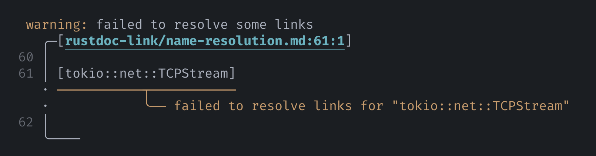

# Known issues

## Wrong line numbers in diagnostics

When the preprocessor fails to resolve some items, it emits warnings that look like:

<figure>

</figure>

You may notice that the line numbers are sometimes incorrect for your source file. This
could happen in files that use the `{{#include}}` directive, for example.

This is an unfortunate limitation with mdBook's preprocessor architecture. Preprocessors
are run sequentially, with the next preprocessor receiving Markdown source rendered by
the previous one. If preprocessors running before the preprocessor modify Markdown
source in such ways that shift lines around, then the line numbers will look incorrect.

Unless mdBook somehow gains [source map][sourcemap] support, this problem is unlikely to
ever be solved.

<!-- prettier-ignore-start -->
[sourcemap]: https://developer.mozilla.org/en-US/docs/Glossary/Source_map
<!-- prettier-ignore-end -->
