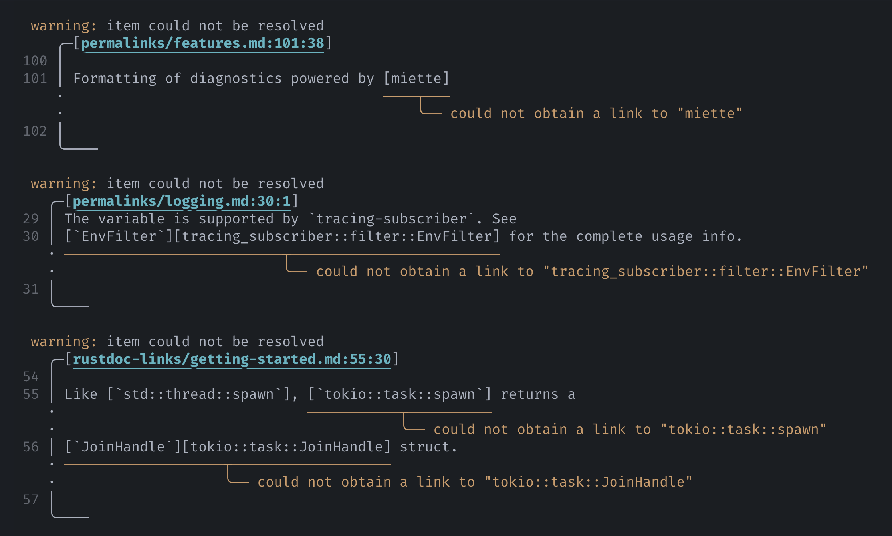
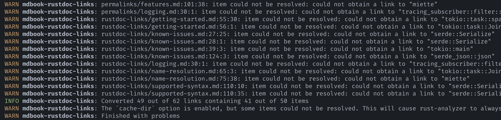

# Logging

With the environment variables `MDBOOK_LOG` and `CI`, you can control how the
preprocessor emits logs and diagnostic information.

## Output style

{{#include ../snippets/logging/output-style.md}}

<figure>

<figcaption>

Diagnostics are displayed in a graphical manner by default.

</figcaption>

</figure>

<figure>

<figcaption>

The same diagnostics emitted as logs

</figcaption>

</figure>

## `MDBOOK_LOG`

{{#include ../snippets/logging/env-var.md}}

## Link report

Upon finishing, the preprocessor can display a list of all supported Rust items it finds
in the book and the URLs generated for each item. The list is sorted alphabetically by
item paths. This can be used to, for example, monitor any changes to the generated links
between builds.

To enable this, add the `link-report=debug` directive to `MDBOOK_LOG`, for example:
`MDBOOK_LOG=info,link-report=debug`.

> [!TIP]
>
> You most likely want to include at least an `info` directive in the variable:
>
> - `MDBOOK_LOG=info,link-report=debug` enables `link-report` on top of existing logs.
> - `MDBOOK_LOG=link-report=debug` will _completely disable_ all other logging,
>   including from mdBook itself.

> [!TIP]
>
> The displayed items are deduplicated and do not contain the links' locations within
> the book. To see their locations (in the format of `path:line:column`), enable `debug`
> for the entire preprocessor, for example, `MDBOOK_LOG=info,mdbook_rustdoc_links=debug`
> or `MDBOOK_LOG=debug`.
