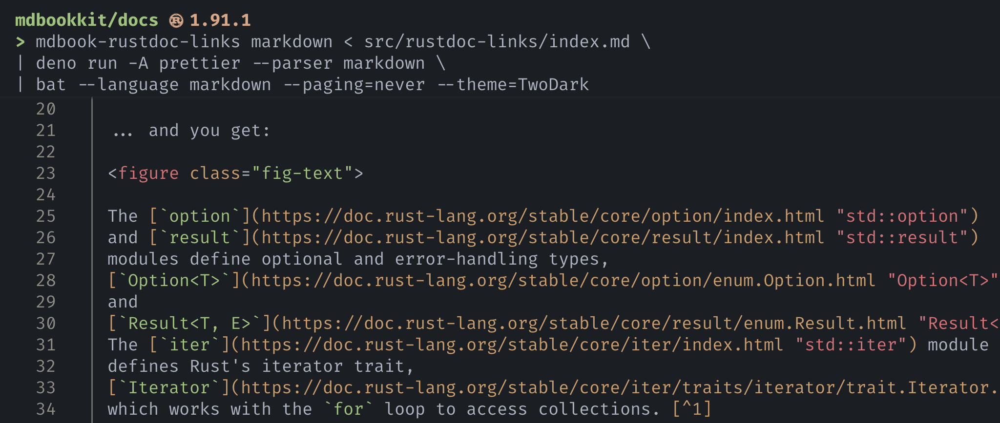

# Standalone usage

You can use `mdbook-rustdoc-links` as a standalone Markdown processor via the `markdown`
subcommand: send your Markdown through stdin, and receive the result through stdout, for
example:

```bash
mdbook-rustdoc-links markdown < README.md
```

The command accepts as arguments all [options](configuration.md) configurable in
`book.toml`, such as [`--cache-dir`](configuration.md#cache-dir). Run
`mdbook-rustdoc-links markdown --help` to see them.

<figure id="media-open-docs">
  
</figure>

<style>
  @media screen and (min-width: 768px) {
    #media-open-docs {
      height: 392px;
    }
  }
</style>
